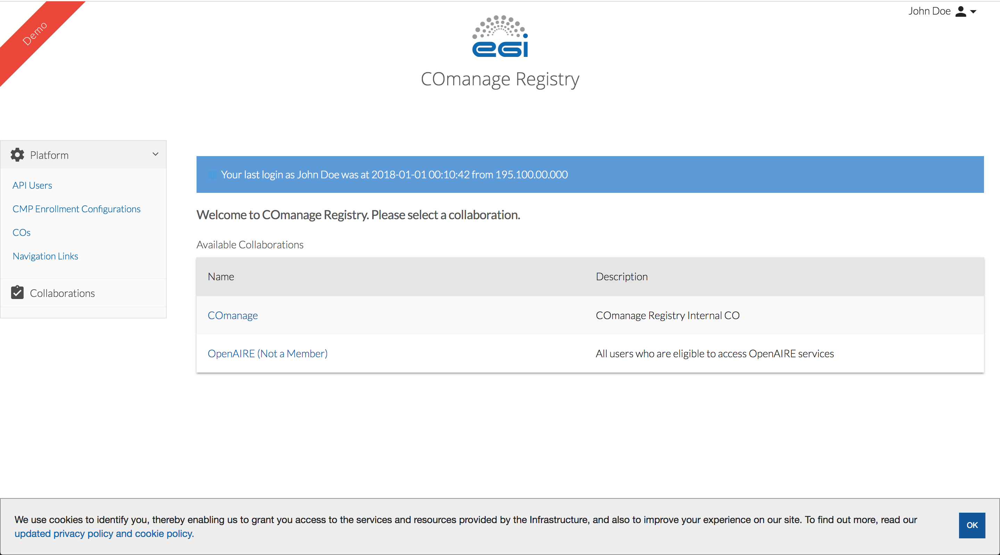

# EGI Check-in theme for COmanage Registry

## Installation

### How to install theme using admin UI

In order to create a new theme, choose `Configuration -> Themes -> Add Theme`.  
After naming the new theme, do the following:

- Leave **Hide Title** unchecked.
- Check **Hide Footer Logo** option.
- Insert into **Header** the contents of the file `header.html`.
- Insert into **Footer** textarea the contents of the file `footer.html`. Be sure to change the links and the images paths according to your needs.
- Copy the contents of `app.css` to **CSS** textarea.

#### Enable Theme at Platform Level
Once you have saved the new theme, go to `Home -> COmanage -> CO Settings` and select the new theme from the **Theme** dropdown.
#### Enable Theme at CO Level
Once you have saved the new theme, go to `Home -> <CO Name> -> CO Settings` and select the new theme from the **Theme** dropdown.
#### Enable Theme at Enrollment Flow Level
Once you have saved the new theme, go to `Home -> <CO Name> -> Configuration -> Enrollment Flows -> <Enrollment Flow Name>(Edit)` and select the new theme from the **Theme** dropdown.

## Customisation

### Images

You can replace the logo by uploading an image with name `logo.png` to `<path-to-comanage-registry>/local/webroot/img/` directory.  
You can also replace the favicon by uploading one with name `favicon.ico` to `<path-to-comanage-registry>/webroot/` directory.

## Compatibility matrix

This table matches the Theme version with the supported COmanage version.

| Theme  | COmanage  |
|:------:|:---------:|
| v1.x.x | v3.1.x    |

## License

Licensed under the Apache 2.0 license, for details see `LICENSE`.
